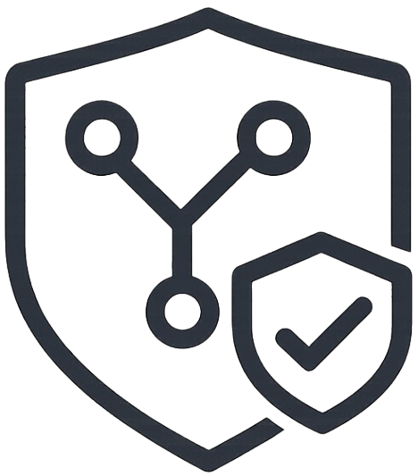

# Prism - PR Safety Mentor

> Your AI-powered safety net for pull requests. Catch issues before they reach code review.



Prism is a local-first VS Code extension that helps developers understand the impact of their changes before pushing code. Think of it as a friendly mentor that reviews your PR and gives you actionable feedback.

## ✨ Features

### 🔍 Smart PR Analysis
Automatically analyzes your git changes and categorizes files by type (Frontend, Tests, CI/CD, Config, Documentation).

**[Screenshot: Analysis Overview]**

### 🚨 Risk Detection
Identifies potential issues before they become problems:
- **Secrets Detection** - Catches API keys, tokens, and credentials before they leak
- **Missing Test Coverage** - Warns when code changes lack corresponding tests
- **CI/CD Changes** - Flags modifications to build pipelines that need extra care
- **Large PRs** - Suggests splitting oversized pull requests
- **Environment Files** - Prevents accidental commits of `.env` files

**[Screenshot: Risk Warnings]**

### 🛡️ Protected Branch Rescue
Accidentally coding on `main` or `master`? Prism detects this and offers to safely move your changes to a new feature branch.

**[Screenshot: Branch Rescue Dialog]**

### ✅ Smart Checklist
Get a personalized pre-push checklist based on your changes:
- **Required** - Must-do items before pushing
- **Recommended** - Best practices for your specific changes
- **Optional** - Nice-to-have improvements

**[Screenshot: Checklist]**

### 🚦 Pre-flight Checks
Automatically detects and runs CI/CD commands locally before you push:
- Parses GitHub Actions, CircleCI, and GitLab CI configs
- Runs tests, linters, and build commands
- Shows pass/fail status for each check

**[Screenshot: Pre-flight Checks]**

### 🤖 AI-Powered Explanations (Optional)
Connect your local Ollama instance for friendly, educational explanations of detected issues. No data leaves your machine.

**[Screenshot: AI Explanation]**

## 🚀 Getting Started

### Installation

1. Install from VS Code Marketplace: [Link coming soon]
2. Or search for "Prism" in VS Code Extensions (`Cmd+Shift+X`)

### Usage

#### Method 1: Sidebar (Recommended)
1. Click the Prism icon in the Activity Bar (left sidebar)
2. Optionally specify a target branch (defaults to `main`)
3. Click "🔍 Analyze My PR"

#### Method 2: Command Palette
1. Open Command Palette (`Cmd+Shift+P` / `Ctrl+Shift+P`)
2. Type "Prism: Analyze My PR"
3. Press Enter

### First-Time Setup

No configuration needed! Prism works out of the box. However, you can customize:

**Settings** (`Cmd+,` → Search "Prism"):
- `prism.defaultTargetBranch` - Default branch to compare against (e.g., `develop`)
- `prism.protectedBranches` - Branches that trigger rescue prompts (default: `main`, `master`)
- `prism.ollamaModel` - AI model for explanations (default: `llama3.2:3b`)

## 🤖 Optional: Enable AI Explanations

Want friendly AI explanations of your PR risks? Install Ollama:

```bash
# Install Ollama (macOS/Linux)
curl -fsSL https://ollama.ai/install.sh | sh

# Pull a model
ollama pull llama3.2:3b

# Start Ollama (runs in background)
ollama serve
```

That's it! Prism will automatically detect Ollama and provide AI-powered insights.

**Privacy Note**: All AI processing happens locally on your machine. No code or data is sent to external servers.

## 📋 Requirements

- VS Code 1.85.0 or higher
- Git repository with at least one commit
- Node.js (for pre-flight checks, optional)

## 🎯 Use Cases

### For Junior Developers
- Learn what makes a good PR before submitting
- Understand why certain changes are risky
- Build good habits with guided checklists

### For Teams
- Reduce code review cycles by catching issues early
- Standardize PR quality across the team
- Prevent common mistakes (leaked secrets, missing tests)

### For Solo Developers
- Self-review before pushing
- Catch mistakes when working late/tired
- Maintain code quality without a team

## 🔒 Privacy & Security

- **100% Local** - All analysis happens on your machine
- **No Telemetry** - We don't collect any data
- **No Network Calls** - Except optional Ollama (also local)
- **Open Source** - Audit the code yourself

## 🐛 Troubleshooting

### "No changes found"
- Make sure you've committed your changes
- Verify you're on a feature branch (not `main`/`master`)
- Check that your branch has diverged from the target branch

### "Analysis failed"
- Ensure you're in a git repository
- Check that `main` or `master` branch exists
- Try specifying a target branch manually

### Pre-flight checks not running
- Verify CI/CD config files exist (`.github/workflows/*.yml`, etc.)
- Ensure required tools (npm, yarn, etc.) are installed
- Check that commands are valid for your local environment

## 💬 Feedback & Support

- **Issues**: [GitHub Issues](https://github.com/yourusername/prism/issues)
- **Feature Requests**: [GitHub Discussions](https://github.com/yourusername/prism/discussions)
- **Questions**: Open an issue with the "question" label

## 📄 License

MIT License - See [LICENSE](LICENSE) file for details

## 🙏 Acknowledgments

Built with ❤️ for developers who want to ship better code.

---

**[⭐ Star us on GitHub](https://github.com/yourusername/prism)** | **[📦 View on Marketplace](https://marketplace.visualstudio.com)**
